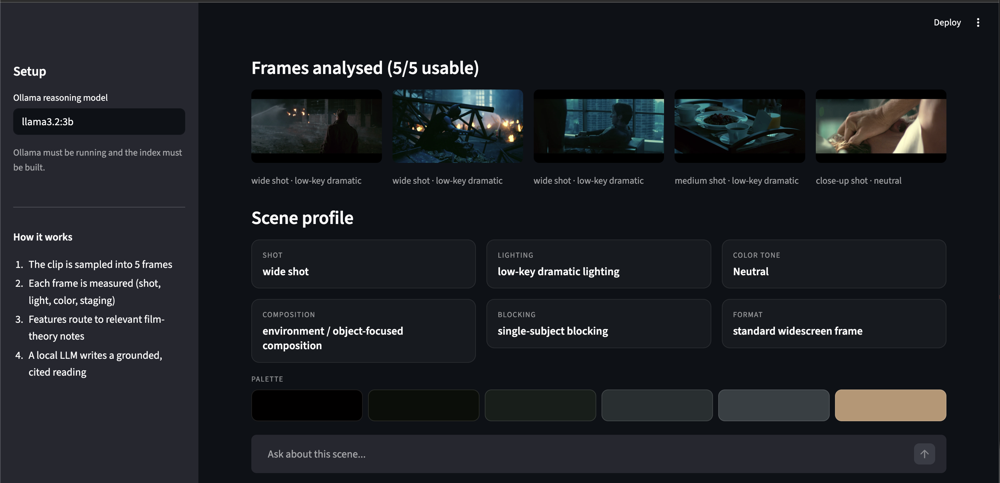
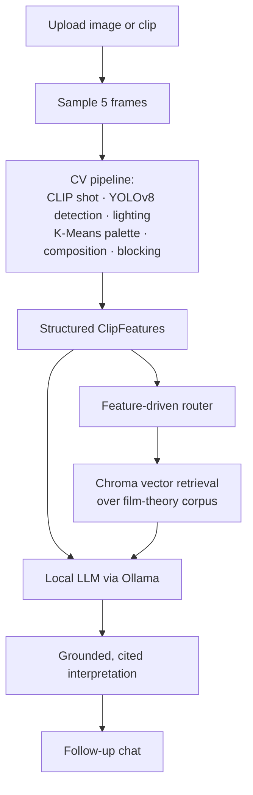
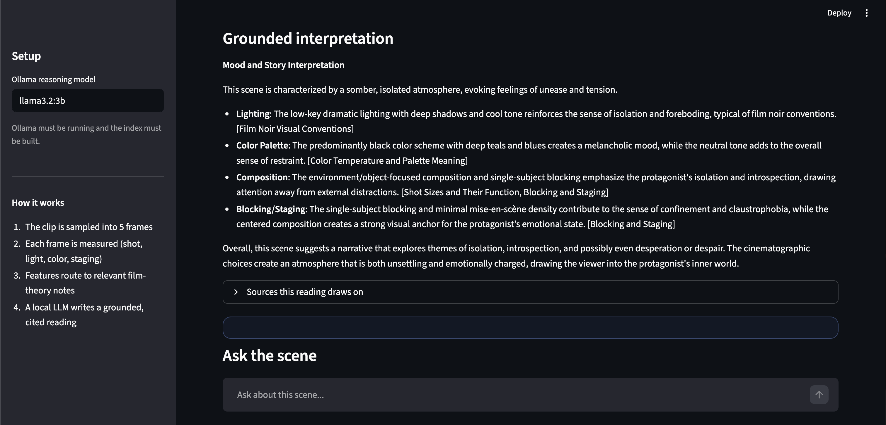
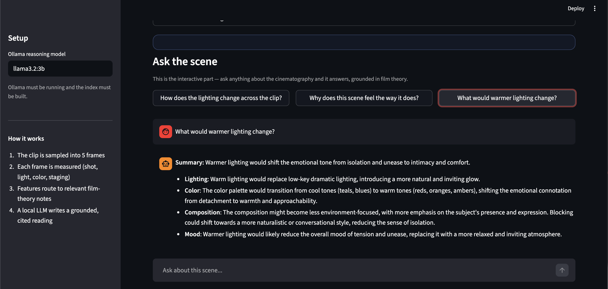

# Cinematic Scene Understanding — RAG Edition

An AI-powered cinematography analyst. Upload a film still or short clip and the
system **measures** the image with a computer-vision pipeline, then **explains**
it in grounded film-theory language — citing the sources it reasons from, and
answering follow-up questions about the scene.

Everything runs **locally**: open models via [Ollama](https://ollama.com), a
local [Chroma](https://www.trychroma.com/) vector store, no external APIs and no
keys.



> This branch (`rag-clean`) extends the original computer-vision portfolio
> project with a Retrieval-Augmented Generation (RAG) reasoning layer. The CV
> pipeline is the foundation; the RAG agent is the evolution.

---

## What it does

- **Samples** a clip into 5 frames (lighting and framing shift within a scene).
- **Measures** each frame: shot type (CLIP), subjects/props (YOLOv8), lighting
  and key-light direction, color palette (K-Means) grouped into families,
  composition, blocking, and mise-en-scène.
- **Retrieves** the most relevant cinematography knowledge for what it measured.
- **Generates** a grounded, cited interpretation with a local LLM — and answers
  free-form follow-up questions about the scene.

The key design decision: the original project turned measurements into
interpretation with hand-written templates. Here, that template layer is
**replaced** by an LLM grounded in a curated knowledge base — so the analysis
reasons from real film theory and cites it, instead of reciting canned phrases.

---

## Architecture



Retrieval is **feature-driven and deterministic** rather than tool-calling:
the measured features decide which knowledge domains to query. This is more
reliable than asking a small local model to choose tools, and it guarantees the
model always sees the relevant theory.

---

## Results

Measured on a labelled evaluation set of six scene types (noir, romance,
western, horror, sci-fi, depth/blocking) via `python -m eval.run --full`:

| Metric | Result |
| --- | --- |
| Citation grounding rate | **100%** (no hallucinated sources) |
| Retrieval recall | **68%** |
| Median retrieval latency | **~140 ms** |
| End-to-end latency | **~12 s** (local 3B model, on-device) |

Grounding and recall are the metrics that matter for a RAG system: *does it
surface the right knowledge, and does it avoid inventing sources?* Retrieval is
deliberately broad to give the LLM rich context, so precision is traded for
recall and grounding by design.

---

## What it looks like

**Grounded, cited interpretation**



**Ask the scene anything**



## Tech stack

**RAG / LLM:** Ollama (Llama 3.2), `nomic-embed-text` embeddings, ChromaDB
vector store, retrieval-augmented generation, LangChain.
**Computer vision:** CLIP (zero-shot shot classification), YOLOv8, OpenCV,
scikit-learn (K-Means).
**App / tooling:** Streamlit, Python, typed dataclass schemas, a labelled
evaluation harness.

---

## Setup

Requires Python 3.10+ and [Ollama](https://ollama.com) installed and running.

```bash
# 1. Install dependencies
python -m venv .venv && source .venv/bin/activate
pip install -r requirements.txt

# 2. Pull the local models
ollama pull llama3.2:3b
ollama pull nomic-embed-text

# 3. Build the knowledge index
python -m scripts.build_index

# 4. Run the app
streamlit run app.py
```

---

## Usage

- **Analyze:** upload an image or clip and click *Analyze scene*. You get a
  Scene profile (shot, lighting, color families, composition, blocking) and a
  grounded interpretation with its sources.
- **Ask:** use the chat box to ask anything about the scene — the agent answers
  grounded in the knowledge base and remembers the scene across turns.

Evaluate retrieval quality and latency:

```bash
python -m eval.run          # retrieval metrics
python -m eval.run --full   # + end-to-end latency and grounding rate
```

---

## Project structure

```
app.py                 Streamlit app (analysis + chat)
knowledge/             Cinematography knowledge corpus (markdown + metadata)
src/vision/            CV pipeline → typed ClipFeatures
src/knowledge/         Load → chunk → embed → store → retrieve (RAG layer)
src/agent/             Router → retrieval → grounded LLM analyst
scripts/               build_index, query_demo, agent_demo
eval/                  Labelled evaluation harness
```

---

## Knowledge base & licensing

The knowledge corpus is original explanatory notes on cinematography
(lighting, color, composition, blocking, and genre conventions), written for
this project. It is designed to be extended with openly-licensed sources
(e.g. CC BY-SA material such as Wikipedia and the Wikibooks Movie Making
Manual); each note carries `source` and `license` metadata.


## Demo

📺 **[Watch the demo video](https://youtu.be/boOyMCoVOVs)**